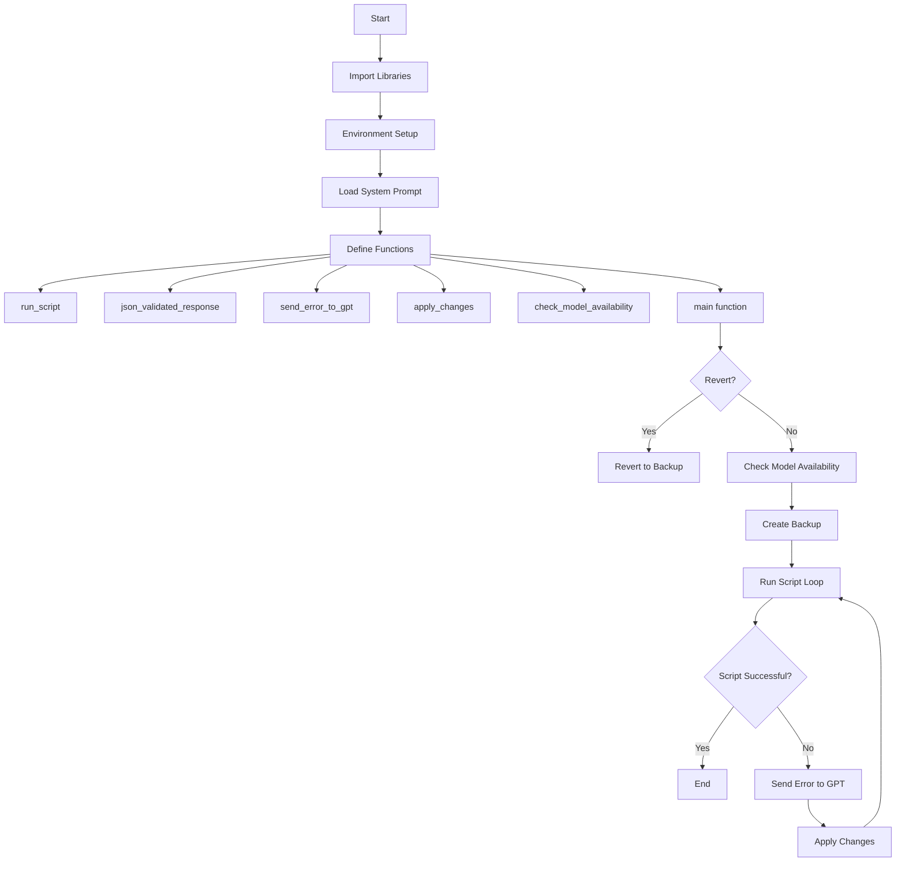

```mermaid
graph TD
    A[Start] --> B[Import Libraries]
    B --> C[Environment Setup]
    C --> D[Load System Prompt]
    D --> E[Define Functions]
    E --> F[run_script]
    E --> G[json_validated_response]
    E --> H[send_error_to_gpt]
    E --> I[apply_changes]
    E --> J[check_model_availability]
    E --> K[main function]
    K --> L{Revert?}
    L -->|Yes| M[Revert to Backup]
    L -->|No| N[Check Model Availability]
    N --> O[Create Backup]
    O --> P[Run Script Loop]
    P --> Q{Script Successful?}
    Q -->|Yes| R[End]
    Q -->|No| S[Send Error to GPT]
    S --> T[Apply Changes]
    T --> P
```